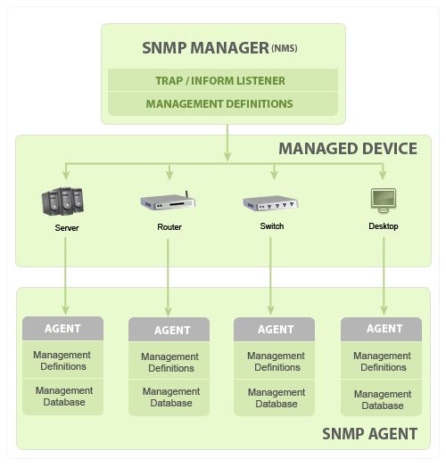
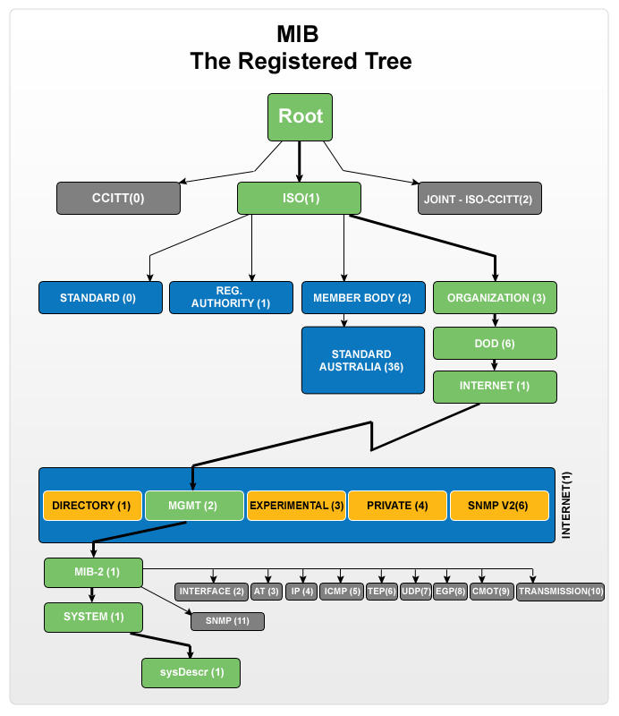

## SNMP:
&nbsp;&nbsp;&nbsp;&nbsp;&nbsp;&nbsp;&nbsp;&nbsp;&nbsp;Simple Network Management Protocol (SNMP) is an application–layer protocol defined by the Internet Architecture Board (IAB) in RFC1157 for exchanging management information between network devices. It is a part of Transmission Control Protocol ⁄ Internet Protocol (TCP⁄IP) protocol suite.

### SNMP basic components
1. SNMP Manager
2.  Managed devices
3.  SNMP agent
4.  Management Information Database Otherwise called as Management Information Base (MIB)

### SNMP Manager:
A manager or management system is a separate entity that is responsible to communicate with the SNMP agent implemented network devices. This is typically a computer that is used to run one or more network management systems.
### SNMP Manager’s key functions
* Queries agents
* Gets responses from agents
* Sets variables in agents
* Acknowledges asynchronous events from agents

### Managed Devices:
A managed device or the network element is a part of the network that requires some form of monitoring and management e.g. routers, switches, servers, workstations, printers, UPSs, etc...
### SNMP Agent:
The agent is a program that is packaged within the network element. Enabling the agent allows it to collect the management information database from the device locally and makes it available to the SNMP manager, when it is queried for. These agents could be standard (e.g. Net-SNMP) or specific to a vendor (e.g. HP insight agent)
### SNMP agent’s key functions
* Collects management information about its local environment
* Stores and retrieves management information as defined in the MIB.
* Signals an event to the manager.
* Acts as a proxy for some non–SNMP manageable network node.
### Basic SNMP Communication Diagram

### Management Information database or Management Information Base (MIB)
Every SNMP agent maintains an information database describing the managed device parameters. The SNMP manager uses this database to request the agent for specific information and further translates the information as needed for the Network Management System (NMS). This commonly shared database between the Agent and the Manager is called Management Information Base (MIB).

Typically these MIB contains standard set of statistical and control values defined or hardware nodes on a network. SNMP also allows the extension of these standard values with values specific to a particular agent through the use of private MIBs.

In short, MIB files are the set of questions that a SNMP Manager can ask the agent. Agent collects these data locally and stores it, as defined in the MIB. So, the SNMP Manager should be aware of these standard and private questions for every type of agent.

### MIB structure and Object Identifier (Object ID or OID)
Management Information Base (MIB) is a collection of Information for managing network element. The MIBs comprises of managed objects identified by the name Object Identifier (Object ID or OID).
Each Identifier is unique and denotes specific characteristics of a managed device. When queried for, the return value of each identifier could be different e.g. Text, Number, Counter, etc...

There are two types of Managed Object or Object ID: Scalar and Tabular. They could be better understandable with an example

Scalar: Device’s vendor name, the result can be only one. (As definition says: "Scalar Object define a single object instance")

Tabular: CPU utilization of a Quad Processor, this would give me a result for each CPU separately, means there will be 4 results for that particular Object ID. (As definition says: "Tabular object defines multiple related object instance that are grouped together in MIB tables")

Every Object ID is organized hierarchically in MIB. The MIB hierarchy can be represented in a tree structure with individual variable identifier.

A typical object ID will be a dotted list of integers. For example, the OID in RFC1213 for "sysDescr" is .1.3.6.1.2.1.1.1

### MIB Tree Diagram

### Basic commands of SNMP
The simplicity in information exchange has made the SNMP as widely accepted protocol. The main reason being concise set of commands, here are they listed below:
* **GET:** The GET operation is a request sent by the manager to the managed device. It is performed to retrieve one or more values from the managed device.
* **GET NEXT:** This operation is similar to the GET. The significant difference is that the GET NEXT operation retrieves the value of the next OID in the MIB tree.
* **GET BULK:** The GETBULK operation is used to retrieve voluminous data from large MIB table.
* **SET:** This operation is used by the managers to modify or assign the value of the Managed device.
* **TRAPS:** Unlike the above commands which are initiated from the SNMP Manager, TRAPS are initiated by the Agents. It is a signal to the SNMP Manager by the Agent on the occurrence of an event.
* **INFORM:** This command is similar to the TRAP initiated by the Agent, additionally INFORM includes confirmation from the SNMP manager on receiving the message.
* **RESPONSE:** It is the command used to carry back the value(s) or signal of actions directed by the SNMP Manager.
 
### SNMP Traps:
SNMP traps enable an agent to notify the SNMP manager of significant events by an unsolicited SNMP message. SNMP Trap protocols include current sysUpTime value, an OID identifying the type of trap and optional variable bindings. Destination addressing for SNMP traps is determined in an application-specific manner typically through trap configuration variables in the MIB. The format of the trap message was changed in SNMPv2 and the protocol data units was renamed SNMPv2-Trap. 
### Typical SNMP communication
Being the part of TCP⁄ IP protocol suite, the SNMP messages are wrapped as User Datagram Protocol (UDP) and intern wrapped and transmitted in the Internet Protocol. The following diagram will illustrate the four–layer model developed by Department of Defense (DoD).

 
By default the SNMP port is 161 and TRAP⁄ INFORM uses SNMP port 162 for communication.
 

SNMP versions
Since the inception SNMP, has gone through significant upgrades. However SNMP Protocol v1 and v2c are the most implemented versions of SNMP. Support to SNMP Protocol v3 has recently started catching up as it is more secured when compare to its older versions, but still it has not reached considerable market share.

SNMPv1:
This is the first version of SNMP protocol, which is defined in RFCs 1155 and 1157

SNMPv2c:
This is the revised protocol, which includes enhancements of SNMPv1 in the areas of protocol packet types, transport mappings, MIB structure elements but using the existing SNMPv1 administration structure ("community based" and hence SNMPv2c). It is defined in RFC 1901, RFC 1905, RFC 1906, RFC 2578.

SNMPv3:
SNMPv3 defines the secure version of the SNMP. SNMPv3 protocol also facilitates remote network monitoring configuration of the SNMP entities. It is defined by RFC 1905, RFC 1906, RFC 3411, RFC 3412, RFC 3414, RFC 3415.
