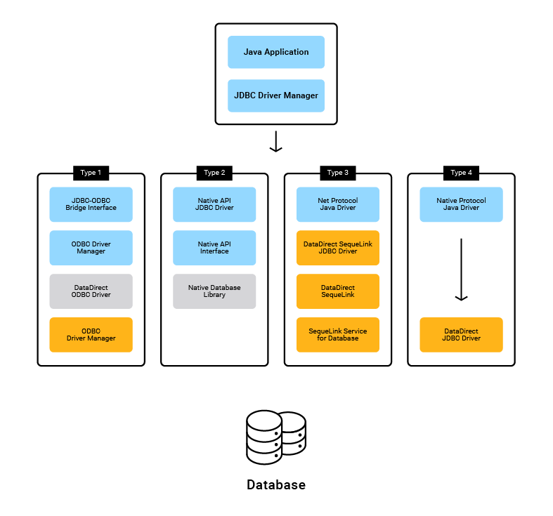

jdbc is  a part of java standard edittion
jdbc specification provide by oracle and implemented by various database vendors

oracle
Driver class: oracle.jdbc.driver.OracleDriver
url :njdbc:oracle:thin:@<host>:<port>:<serviceName>
eg: jdbc:oracle:thin:@localhost:1521:XE
port :1521

mySql:
Driver:com.mysql.jdbc:Driver
url:jdbc:mysql://<host>:port:3306:XE

drivers is the piece of code or  set of  instruction which helps to communicate  between different betwuum two different hardwares hardware and software and between two softer
driver can be written in any  languages like c c++ java
driver works like a translator eg: motherboard driver , camera driver...

driver which helps to communicate with devices are known as device drivers

jdbc driver: jdbc driver translates the jdbc instruction from java application into native database instructions for DB server

there are four types of driver available in jdbc:
type 1
type2
type 3
type 4 (it is recommendable)

