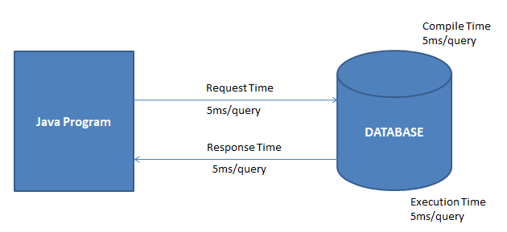
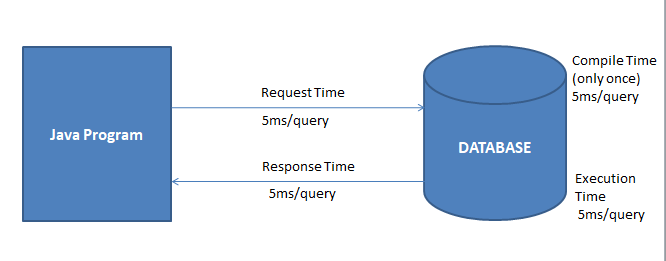
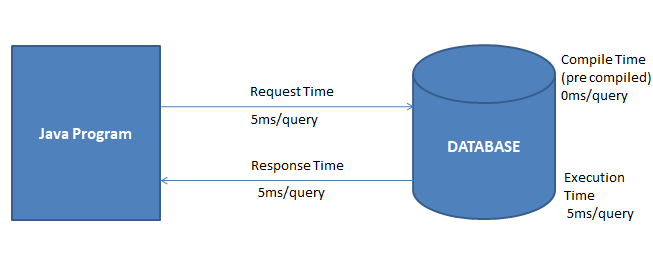

jdbc is  a part of java standard edittion
jdbc specification provide by oracle and implemented by various database vendors

oracle
Driver class: oracle.jdbc.driver.OracleDriver
url :njdbc:oracle:thin:@<host>:<port>:<serviceName>
eg: jdbc:oracle:thin:@localhost:1521:XE
port :1521

mySql:
Driver:com.mysql.jdbc:Driver
url:jdbc:mysql://<host>:port:3306:XE

drivers is the piece of code or  set of  instruction which helps to communicate  between different betwuum two different hardwares hardware and software and between two softer
driver can be written in any  languages like c c++ java
driver works like a translator eg: motherboard driver , camera driver...

driver which helps to communicate with devices are known as device drivers

jdbc driver: jdbc driver translates the jdbc instruction from java application into native database instructions for DB server

there are four types of driver available in jdbc:
type 1
type2
type 3
type 4 (it is recommendable)

# JDBC STATEMENTS

there are 3 types of statements 
1. Statement
2. Prepared Statement
3. Callable Statement

# Query Execution 

we can use one of the following methods on Statment object to submit 
the SQL statement to Database:

* public int executeUpdate(String sql)
* public ResultSet executeQuery(String sql)
* public boolean execute(String sql)

__1.public int executeUpdate(String sql)__
	when you want to submit __INSERT__ or __UPDATE__ or __DELETE__ 	sql statements then use *executeUpdate()* which returns the 	*number of records* inserted or updated or deleted.

__2.public ResultSet executeQuery (Sting Sql)__
	when you want to submit __SELECT__ SQl statement then use 	*executeQuery* which return ResultSet object contains the records
	returned by the select statement

__3.public boolean execute(String sql)__
	when you want to submit __INSERT,UPDATE,DELETE or SELECT__ SQL 	statements then use *execute()* method which returns the boolean
	value.
	
    if execute() returns true - select SQL statement is submitted and ResultSet got created
    		call the getResultSet() which returns the ResultSet
    		public ResutlSet getResultSet()
    		
    if execute () returns false - INSERT,UPDATE,DELETE SQL statements are submitted and 
    		integer number is available (no of records inserted , updated or deleted)
		call getUpdateCount() which return the count
		public int getUpdateCount()

#	Statement 

Using the single statement object , you can submit any type of SQL 
statements and any number of SQL statements 

example:

	Statement statement= con.createStatement()
	String sql1="insert.."; String sql2="update...";
	String sql3="delete..";String sql4="select..";
	
	boolean status = statement.execute(sql1);
	int x= statement.executeUpdate(sql2);
	int y= statement.executeUpdate(Sql3);
	ResultSet rs= statement.executeQuery(sql4);
	
			

When you submit the SQL statement using Statement Object then SQL
statement will be compiled and executed every time.

	
	

Total time 	= request time + compile time+execute time +response time 	= 5+5+5+5	= 20 ms

100 SQL query 		= 100*20  
Total time 		= 2000 ms

# MySQL queries

create table students(
studid int primary key,
studname varchar(10),
studemail varchar(10),
phone long);

#  PreparedStatment 

* Prepared statement is an interface available in java.sql.package
* Prepared statement is extending Statement Interface
	class PreparedStatement extends Statement{
	.......
	}
* Subclass of PreparedStatement interface is provided by Driver vendor 
* you can create a prepared statment object using the following method of Connection Interface
	public PreparedStatement prepareStatement(sql);
* you can call one of the following methods on prepared statement object to submit sql statments 
			public int executeUpdate()
			public ResultSet executeQuery()
			public boolean execute()
* using Single preparedstatement object you can submit only one sql statement

* when we submit the sql statement using prepared statement object then sql statement will be __compiled__ only once i.e first time and 
precompiled SQL statement will be executed every time.

TotalTime = request time +compile time +execution time +response 

	  = 5 + 5 + 5 + 5= 20 ms 
	 
First Time 		= 20ms

2nd onwards		= 5ms +0ms+5ms +5ms

			=15ms
			
100 sql statements 	= 20ms +99*15ms
			= 1505ms

* Prepared Statment gives you the place holder mechanism for providing the data dynamically to the sql statments. you need to use __?__ symbol for place holder 

* To provide the value for placeholder, you need to invoke the setter method depending on the placeholder data type.

				* public void setInt(int paramIndex, int val);
				* public void setString(int paramIndex, String val);
				* public void setLong(int paramIndex,long val);
				* public void setDouble(int paramIndex, double val);
				etc...

#  Callable Statement 

* CallableStatement is an interface available in java.sql.package.
* CallableStatement is extending PreparedStatement interface
* subclass of CallableStatement interface is provided by Driver vendor.
* you can create the Callable Statement object using the following methods of Connection interface 
		
		public CallableStatement prepareCall(sql)
		public CallableStatement prepareCall(sql,int,int)
		public CallableStatement prepareCall(sql,int,int,int)

* you can call the following method on CallableStatement object to submit the SQL Statement to Database
		
		public boolean execute()
		
* using the single CallableStatement Object,you can submit call to only one procedure 
	
	eg: 
	String sql = "callProc1(?,?)";
	CallableStatement cal = con.prepareCall(sql);
	cal.setInt(1,10);
	cal.setInt(2,20);
	cal.execute();
	

	
* when you submit the call to stored procedures using CallableStatement object thne pre compiled stored procedures will be executed directly 

	4 sqlStatements = 5 + 0 + 4*5  + 5 m = 30 ms

	4 SqlStatement *25 = 30*25 = 750ms 
	
* Callable statement gives you the place holder mechanism for providing the data dynamically to the procedure parameters , you need to invoke
the setter meethods depending on the placeholder data type.

				 public void setInt(int paramIndex, int val);
				 public void setString(int paramIndex, String val);
				 public void setLong(int paramIndex,long val);
				 public void setDouble(int paramIndex, double val);
				etc...

you need to use the following method to specify the OUT parameter 
	public void registerOutParameter(int parameterIndex,int sqlType)
		* sql type is a constant from java.sql.Types class

you can use getters
				 public void getInt(int paramIndex, int val);
				 public void getString(int paramIndex, String val);
				 public void getLong(int paramIndex,long val);
				 public void getDouble(int paramIndex, double val);
				
__Queries__

create table students(
studid int primary key,
studname varchar(10),
studemail varchar(10),
phone long);

delimiter $
create procedure insertStudentInfo(id int , name varchar(20),
mail varchar(20),phone long)
begin
insert into students values(id,name,mail,phone);
end;
$

create table studentsfee(
studid int primary key,
studname varchar(10),
fee float);

insert into studentsfee values(7,'farooq',256.45);

DROP PROCEDURE IF EXISTS updateInfo; 

delimiter $
create procedure updateInfo(id int , OUT name varchar(20),INOUT inc float)
begin
update studentsfee set fee=fee+inc where studid =id;
select studname,fee into name,inc from studentsfee where studid=id;
end;
$

#### Batch

When you submit multiple queries to database one by one then lot of time will be wasted for request and response 

Using Statement or Prepared Statement when we try to execute 100 sql statements,
you need to communicate with database 100 times , this increases the number of roundtrips between your application and database which damages the application 
performance.

Batch update allows you to submit Multiple SQL Statements to the Database at a time. 

Using Batch Updates

For 100 SQL statements = 5 + 100*5 + 5*100 + 5 = 1010ms

#Using Batch Updates With Statement:

1. you can submit multiple types and Multiple queries of SQL statments
2. you can reduce the number of roundtrips between your application and database which damages the application performance.
3. Batch update can use insert, update and delete statements only
4. you cannot use select statement 
5. use the following methods of statement interface to implement Batch Updates.
	void addBatch(String Query)
	int [] executeBatch()
	void clearBatch()

#Using Batch Updates With Prepared Statement:

1. you can submit only single type of sql statment and Multiple SQL statments
2. you can reduce the number of roundtrips between your application and database which damages the application performance.
3. Batch update can use insert, update and delete statements only
4. you cannot use select statement 
5. use the following methods of statement interface to implement Batch Updates.
	void addBatch()
	int [] executeBatch()
	void clearParameter()

####Result Set

* Resultset is an interface available in java.sql package 
* Subclass of Result Set interface is provided by Driver Vendor.
* ResultSet object contains the records returned by select statements 
* ResultSet objects can be created by using the following methods.

	ResultSet rs = st.executeQuery("select ..."); //Statement interface
	ResultSet rs = pc.executeQuery(); //PreparedStatementInterface

* When a Result set object is created then initially Resultset cursor points to before to the first record 
you can use the next method to move the resultSet pointer in the forward direction.
	
	public boolean next(){
	
	Checks whether next record is available or not 
	if next record is present , then moves the pointer to next record 
	return true;
	
	if next record is not present , then moves the pointer to next position
	return false 
	
	}

* you can use the previous() method to move the result set pointer in the reverse direction 
		
			public boolean previous(){
			//checks whether previous record is available or not.
			if previous record is available then moves the pointer to previous record 
			return true
			
			if previous record is not present then moves the pointer to previous position 
			
			return false

	* When ResultSet pointer is pointing one record then you can access the data of various columns using getXX() method 
				public int getInt(int columnIndex)
				public int getInt(String columnName)
				public String getString(int columnName)
				public String getString(String columnName)
				etc..
				
### Types of ResultSet 

Depending on the resultsset cursor movements you can divide the ResultSet into 2 types 
1. Forward-only ResultSets
2. Scrollable ResultSets

# Forward-only ResultSets:

* pointer can be moved in forward direciton only 
* pointer can be moved only once
* pointer can be moved in sequential order

By Default , Resultset are forward only

you can explicitely specify the resultset as forward only as follows 

Statement st = con.createStatement(ResultSet.TYPE_FORWARD_ONLY,..);

you can use following method on Forward only resultset
public boolean next()
public boolean isBeforeFirst()
public boolean isFirst()
public int getRow()
public boolean isAfterLast()
public boolean isLast()
etc

# Scrollable ResultSet

* pointer can be moved in both forward and reverse direction 
* pointer can be moved multiple times
* pointer can be moved in random order 

by default Resultset are not scrollable 
you can explicitely specify the result set as scrollable 

Statement stmt = con.createStatement(ResultSet.TYPE_SCROLL_SENSITIVE,...);

PreparedStatement ps= con.prepareStatement("select * .. ,ResultSet.TYPE_SCROLL_SENSITIVE);

public boolean next()
public boolean isBeforeFirst()
public boolean isFirst()
public int getRow()
public boolean isAfterLast()
public boolean isLast()
public boolean absolute(int)
public boolean relative(int)
public boolean previous()
